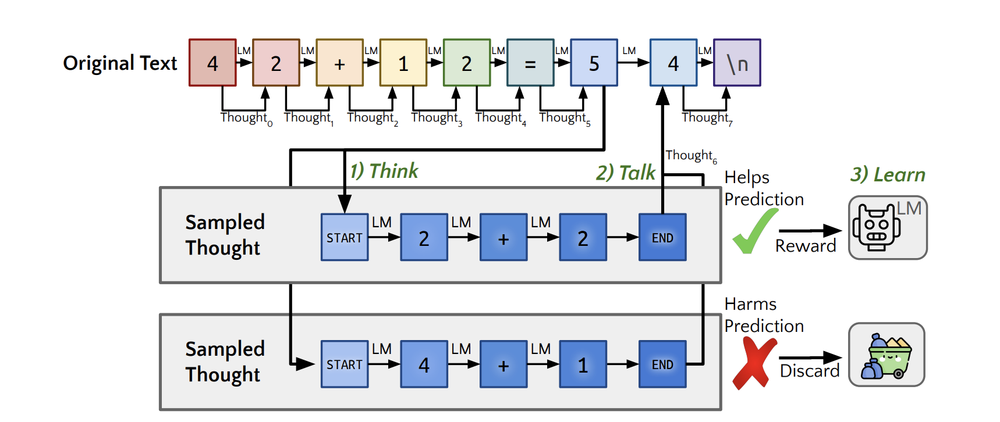
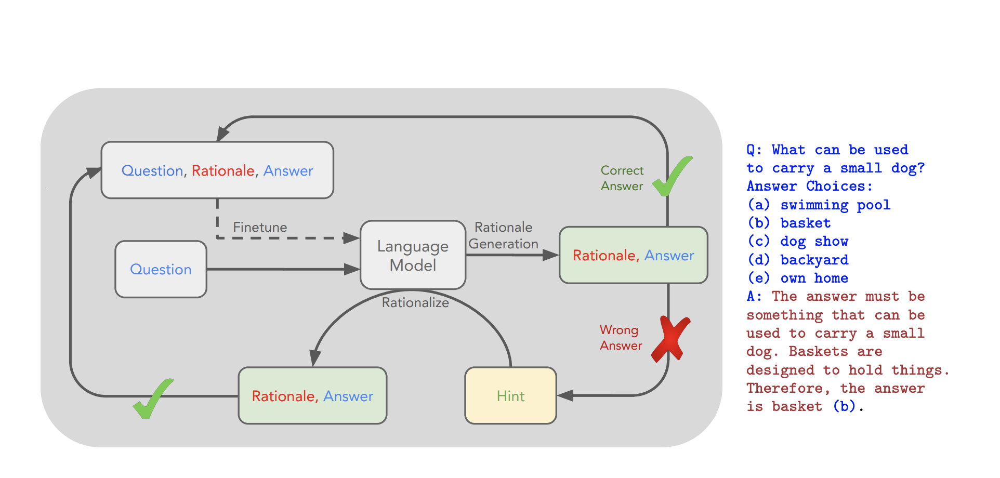

# Discussion on Human-Like Reasoning Implementation Attempts in LLMs

## Quiet-STaR and STaR (Self-Thaught Reasoner) 

papers:

* [Quiet-STaR: Language Models Can Teach Themselves to Think Before Speaking, Eric Zelikman et al, Stanford U., 2024](https://github.com/dimitarpg13/aiconcepts/blob/master/literature/LLM/human_like_reasoning/Quiet-STaR-Language_Models_Can_Teach_Themselves_to_Think_Before_Speaking_Eric_Zelikman_2024.pdf)

* [STaR: Self-Taught Reasoner Bootstrapping Reasoning With Reasoning, Eric Zelikman et al., Stanford U. 2022](https://github.com/dimitarpg13/aiconcepts/blob/master/literature/LLM/human_like_reasoning/STaR-Self-Taught_Reasoner_Bootstrapping_Reasoning_With_Reasoning_Eric_Zelikman_2022.pdf)

\
Figure 1: Quiet-STaR algorithm

That is not thinking really. This is another predictive engine which has been trained on preexisting "thoughts". The novelty here is that an online reinforcement learning apparently is being used (policy gradient algorithm REINFORCE) in the "thought" generation. However, I do not see reinforcement-based 𝐬𝐢𝐦𝐮𝐥𝐚𝐭𝐢𝐨𝐧 where 1) "thoughts"/ semantic structures are assembled based on 𝐬𝐞𝐦𝐚𝐧𝐭𝐢𝐜 𝐥𝐚𝐰𝐬 for the evolution of a 𝐝𝐲𝐧𝐚𝐦𝐢𝐜𝐚𝐥 𝐬𝐲𝐬𝐭𝐞𝐦 and 2) thought inferences are reinforced from previously made inferences. (The latter part 2) of the last statement apparently Zelikman attempts to model in his model). In such kind of simulation thinking will not arise immediately but it will be an emergent phenomenon in an evolutionary process based on the semantic laws (equations of evolution) of the dynamical system. 
It is a definitely interesting idea which models an important aspect of human thinking - that is reinforcing certain types of "thoughts" based on previously made inferences. but I do not think that this is thinking. What Zelikman is doing is very interesting (and I think 𝐚 𝐟𝐢𝐫𝐬𝐭) - the application of policy gradient RL in online context inside an LLM to reinforce reasoning based on "thoughts" generated in the past and discard "harmful" thoughts with low enough rewards. What Eric Zelikman has done is definitely a step in the right direction.

In [the earlier paper of Zelikman](https://github.com/dimitarpg13/aiconcepts/blob/master/literature/LLM/human_like_reasoning/STaR-Self-Taught_Reasoner_Bootstrapping_Reasoning_With_Reasoning_Eric_Zelikman_2022.pdf) on self-thaught reasoning Eric Zelikman does not use Reinforcement Learning to strengthen the importance of previously generated chain of "thoughts". Instead he has adopted the more conventional RAG-like approach in his training loop as can be seen on Figure 2.

\
Figure 2: The STaR algorithm
